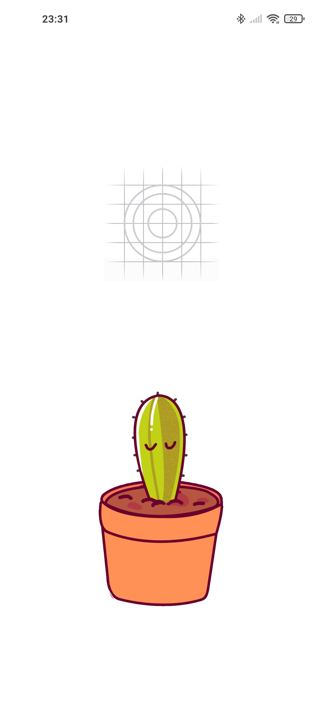
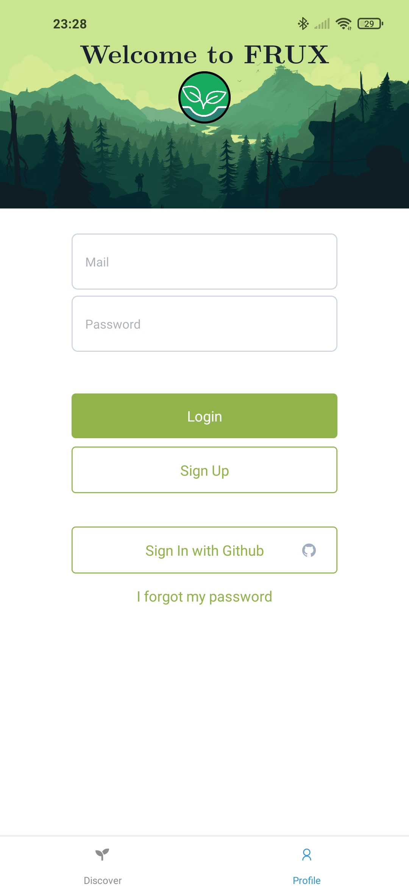
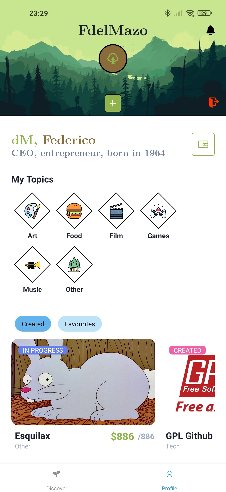
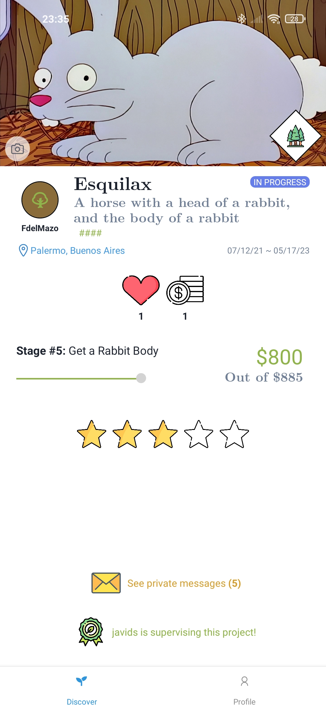

# frux-mobile

Android Client for Frux.

## How can I install Frux in my phone?

Here is our [latest stable APK](https://expo.io/artifacts/5fc6330d-633c-4d8a-944b-53a4013d57af)!

## What is Frux?

Frux is the newest crowdfunding app in town.

Before reading this repo, you should probably visit our [homepage](https://www.notion.so/fdelmazo/frux-efab2dee3dd74d52b2a57311a1891bd4), with lots of info on the development, latest news, and lots (_lots_) of documentation.

If you are only interested in the source code, check out the different repos!

- [frux-app-server](https://github.com/camidvorkin/frux-app-server)
- [frux-web](https://github.com/JuampiRombola/frux-web)
- [frux-mobile](https://github.com/FdelMazo/frux-mobile)
- [frux-smart-contract](https://github.com/JDSanto/frux-smart-contract)
- [frux-chat](https://github.com/JDSanto/frux-chat)

Frux is currently being developed by

- [@fdelmazo](https://www.github.com/FdelMazo)
- [@camidvorkin](https://www.github.com/camidvorkin)
- [@JuampiRombola](https://www.github.com/JuampiRombola)
- [@JDSanto](https://www.github.com/JDSanto)

## How does frux-mobile look?

<table align="center">
    <tr>
        <td></td>
        <td></td>
    </tr>
    <tr>
        <td></td>
        <td></td>
    </tr>
</table>

## Tech Stack

This mobile app is developed in [React Native](https://reactnative.dev/) with tremendous help from [Expo](https://expo.io/). The UI framework used is [Magnus](https://magnus-ui.com/), and is truly one of the best mobile UI frameworks out there.

## Try it out!

Go to your favourite Android device and download the [Expo Go](https://expo.io/client) app. After that you can either input the Expo link or scan the Expo QR to try out the latest build (thanks to some Github CI magic). Keep in mind that there are some features (mostly those regarding third-party calls, like sign in with Github) that only work on the APK, because those are mostly production env stuff.

[`exp://exp.host/@fdelmazo/frux-mobile`](https://expo.io/@fdelmazo/frux-mobile)

If you prefer to use the latest build in APK form, just go over to the [Github Actions tab](https://github.com/FdelMazo/frux-mobile/actions) of this repo and click on the latest workflow run. In there you'll see the different build steps of the app, and on the last line of the build command you'll find the link to download the latest APK.

Even though this app is only developed for Android devices, Expo makes it pretty easy to port it to iOS too. If you are feeling risky, feel free to try it out on an iOS device with the Expo Go client installed.

## Developing

For development you'll need to have the Expo CLI installed in your system. You can do so by running `npm install -g expo-cli`

After cloning this repository, install the dependencies with `npm install` and then you'll be free to start developing right away with `expo start`

For some users actions you'll need a properly set up environment with the Firebase credentials. Just ask one of the original developers for their own `.env` file and copy it into the root directory of the project.

Dev note: keep in mind, there are four places where you should add any new env variable: your own personal `.env` (of course), the `.env.example` file, the `.github/workflows/build.yml` file, and most importantly, the [gh actions secrets page of this repo](https://github.com/FdelMazo/frux-mobile/settings/secrets/actions)
